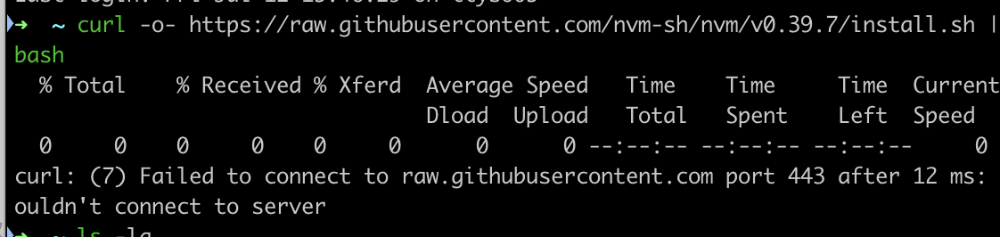

# 前端开发 Mac 装机必备

## 梯子后不能只能拉取



1. 终端运行

```shell
code ~/.zshrc
```

2. 最后添加（以下命令，通过代理软件ClashX，右键，复制终端命令获取）

```shell
export https_proxy=http://127.0.0.1:7890 http_proxy=http://127.0.0.1:7890 all_proxy=socks5://127.0.0.1:7890
```

3. 运行

```shell
source ~/.zshrc
```

| 名称                      | 备注说明                                                     |      |
| ------------------------- | ------------------------------------------------------------ | ---- |
| 翻墙                      | <https://go.runba.cyou/auth/login> 登录账号， 可同步`chrome`账号 |      |
| ClashX                    | 翻墙                                                         |      |
| Chrome                    | 浏览器                                                       |      |
| VSCode                    | 编辑器                                                       |      |
| Paste                     | 保留历史粘贴                                                 |      |
| ihosts                    | 修改本地 host 指向                                           |      |
| Rectangle                 | 和`window`一样方便主页分屏                                   |      |
| Homebrew                  | 通用包管理                                                   |      |
| 安装 node                 | brew install node                                            |      |
| 安装 git                  | brew install git                                             |      |
| 安装 mysql                | brew install mysql; 默认密码设置有问题，后来通过 `ChatGPT` 解决 |      |
| 安装 nvm                  | https://github.com/nvm-sh/nvm                                |      |
| iTerm2 + Oh-my-zsh + 插件 | TODO: 之后补充                                               |      |
| Tower                     | git 工具                                                     |      |
| Navicat Premium           | 如果启动不了：<https://blog.idejihuo.com/db-tools/navicat-16-for-mac-permanent-crack-tutorial.html> |      |
| WPS Office                | 三件套                                                       |      |
| Firefox                   | 浏览器                                                       |      |
| ScreenHint                | 截图需要长固定                                               |      |
| HandBrake                 | 视频转换 mp4                                                 |      |
| Typora                    | markdown 编辑器                                              |      |
| Xmind                     | 脑图                                                         |      |
| Zed                       | 快速编辑器                                                   |      |
| Proxyman                  | 代理工具                                                     |      |
| IINA                      | 视频播放器                                                   |      |
| Beyond Compare            | 用于文件、文件夹比较                                         |      |
| 微信开发者工具            | 微信编辑器                                                   |      |
| Axure RP 9                | rp 查看器                                                    |      |
| HBuilderX                 | 开发 uni-app 编辑器                                          |      |
| ColorSlurp                | 颜色 pick                                                    |      |
| PDManer                   | 数据表、数据关系管理软件                                     |      |
